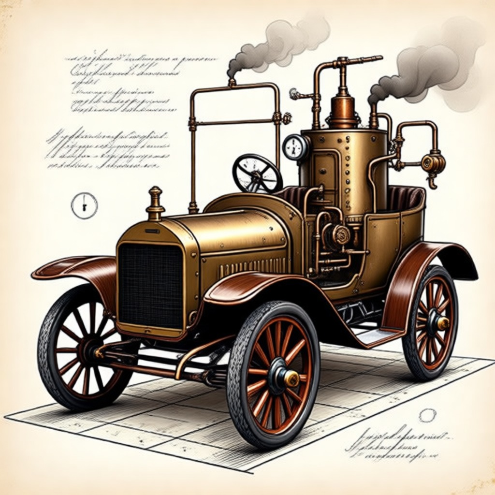

# Steampunk Image Skill

Turn images into steampunk — the same picture rebuilt in brass — or design Victorian engineering-plate posters from a text brief. Not generic steampunk vibes, not a goggle sticker.

## What it looks like

| Before | After |
| --- | --- |
|  |  |

Same cat, same yawn — re-built in brass, one real mechanism visible. Twelve worked runs (input + prompt + output each) live in [examples/](./examples/README.md); every input photo there is CC0 / public domain, so you can reuse them in your own posts.

## Twelve restyles

Vehicles, pets, food, streets, buildings, skies — every run keeps the original composition and builds in one readable mechanism. Click any folder name for input + prompt + full-size output.

| Before | After | Before | After |
| --- | --- | --- | --- |
| **Car** ([↗](examples/car/))  |  | **Bicycle** ([↗](examples/bicycle/))  |  |
| **Motorcycle** ([↗](examples/motorcycle/))  |  | **Biplane** ([↗](examples/airplane/))  |  |
| **Airship** ([↗](examples/balloon/))  |  | **Cat** ([↗](examples/cat/))  |  |
| **Dog** ([↗](examples/dog/))  |  | **Latte** ([↗](examples/coffee/))  |  |
| **Street busker** ([↗](examples/street/))  |  | **Clock tower** ([↗](examples/clocktower/))  |  |
| **Dusk skyline** ([↗](examples/skyline/))  |  | **1783 portrait** ([↗](examples/portrait/))  |  |

## Avatars that survive the circle crop

A dedicated **Avatar mode**: face locked, square 1:1, one small mechanism at the crop edge, plain walnut background. Nine CC0/PD portraits — paintings and museum busts — forged as one set:

<p align="center">
  
</p>

Rules and template: [SKILL.md → Avatar mode](#avatar-mode), [prompt.md → AVATAR](prompt.md). Individual portraits: [examples/avatar/](examples/README.md#avatar-mode--circle-crop-safe).

## Two modes

| You give | You get |
| --- | --- |
| A photo + "把它变成蒸汽朋克" | **Restyle**: same composition, same subject — materials re-built as brass/copper/iron/leather, palette forced to five inks, one real mechanism built into the subject |
| A portrait + "给我做个头像" | **Avatar**: square brass-plate bust that survives a circular crop — face locked, one mechanism at the edge |
| A text brief ("城市骑行活动海报") | **Poster**: a Victorian engineering-plate design with a locked mechanical thesis, layout, and stamped typography |

The restyle mode is image-first: the original photo is passed to the image tool together with the prompt, a **fidelity contract** locks composition and identity, and drift (new composition, replaced subject, neon surviving) is rejected at the quality gate.

## Install

With the open [skills CLI](https://github.com/vercel-labs/skills):

```bash
npx skills add tutao0123/steampunk-image-skill
```

Cursor only:

```bash
npx skills add tutao0123/steampunk-image-skill --agent cursor
```

Codex only:

```bash
npx skills add tutao0123/steampunk-image-skill --agent codex
```

All agents on this machine:

```bash
npx skills add tutao0123/steampunk-image-skill -g --all
```

Then drop a photo ("把这张图改成蒸汽朋克风格") or give a brief ("给茶馆音乐会出一张蒸汽朋克海报").

## Where images come from

- Agents with a built-in image tool: the skill attaches the original photo and prompt directly.
- Coding agents without one (Codex 等): the skill calls `scripts/restyle.py` (stdlib-only Python). Default provider is [SiliconFlow](https://siliconflow.cn) — `Qwen/Qwen-Image-Edit-2509`, ≈¥0.30/image, direct access in China, key in `SILICONFLOW_API_KEY`. `--provider openrouter` switches to [nano banana](https://openrouter.ai/google/gemini-2.5-flash-image-preview) / [gpt-image-1](https://openrouter.ai/openai/gpt-image-1) (key in `OPENROUTER_API_KEY`; image models are region-locked by OpenRouter for some networks).

## Visual lock (both modes)

- Inks: antique brass, oxidized copper, iron rust red, warm parchment beige, deep walnut brown
- Poster paper: aged vellum / letterpress; restyle keeps the photo's scene, re-materialized
- Type: engraved Victorian serif title; condensed stencil labels
- Forbidden: neon, cyan, magenta, cute cartoon steampunk, goggles-as-subject, cyberpunk, glossy 3D renders

## Files

| File | What it is |
| --- | --- |
| [SKILL.md](./SKILL.md) | Runbook: mode selection, restyle workflow, poster workflow, quality gate |
| [prompt.md](./prompt.md) | Fill-in prompt template per mode |
| [style.md](./style.md) | Ink, paper, type, print language; restyle exceptions |
| [machines.md](./machines.md) | Subject → real mechanism mapping; photo reference rules |
| [layouts.md](./layouts.md) | Poster plate layouts |
| [examples.md](./examples.md) | Worked examples, mode-tagged |
| [examples/](./examples/README.md) | Real runs: input + prompt + output for cat / portrait / street / coffee / car |
| [scripts/restyle.py](./scripts/restyle.py) | OpenRouter img2img / text-to-image caller (Codex 等无图像工具的 agent 用) |

## License

MIT. The example input photos in `examples/` are CC0 or public domain (credits in [examples/README.md](./examples/README.md)); example outputs are generated images shown for demonstration.
