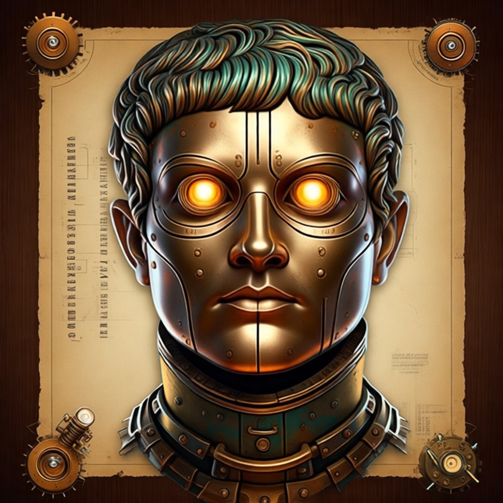
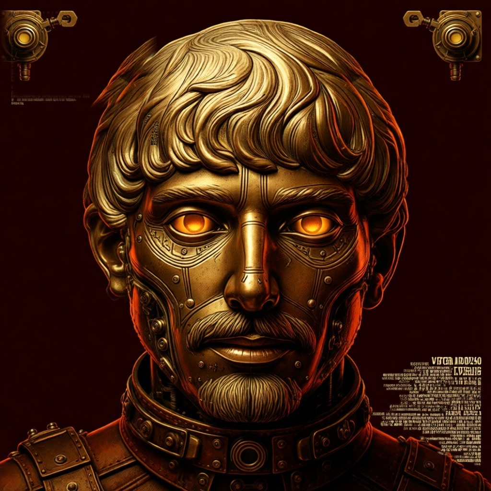
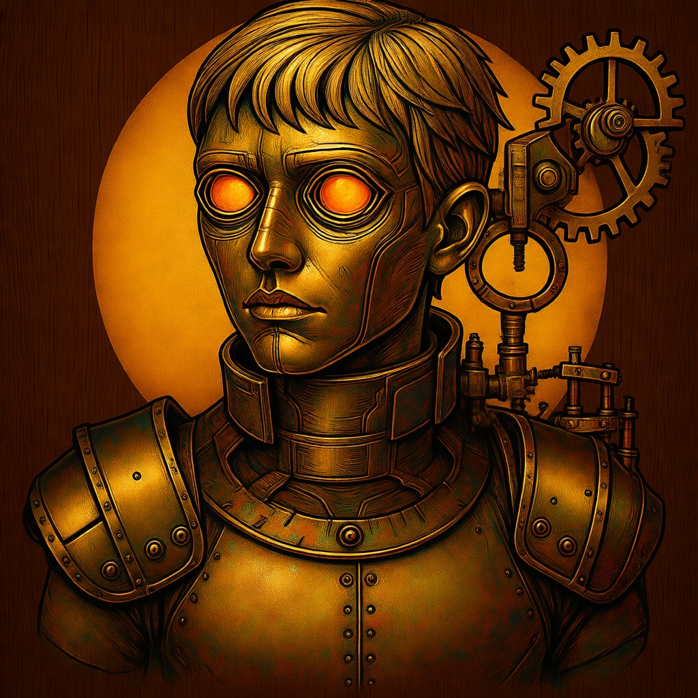
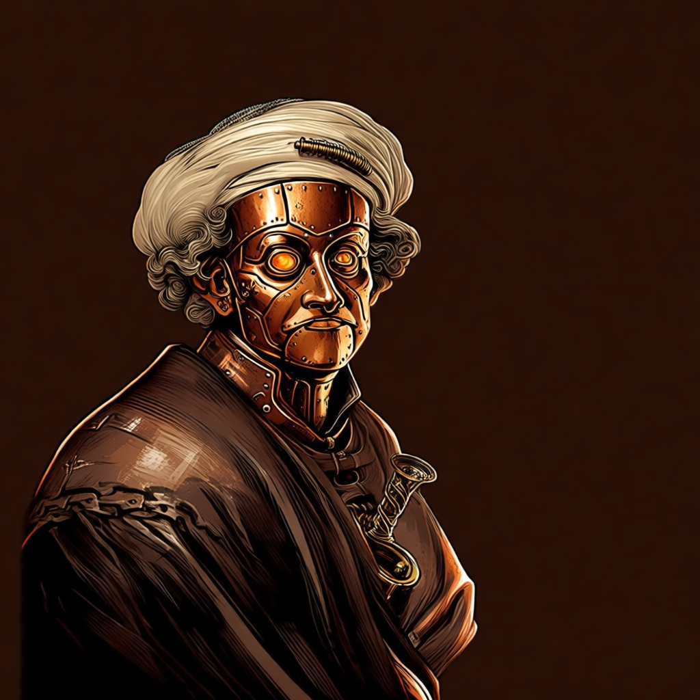
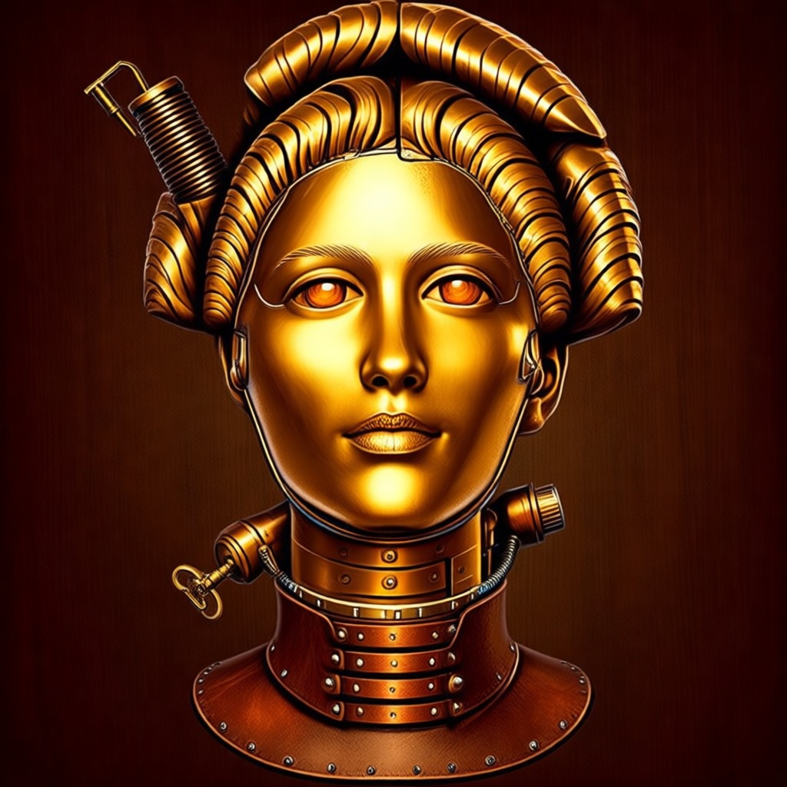
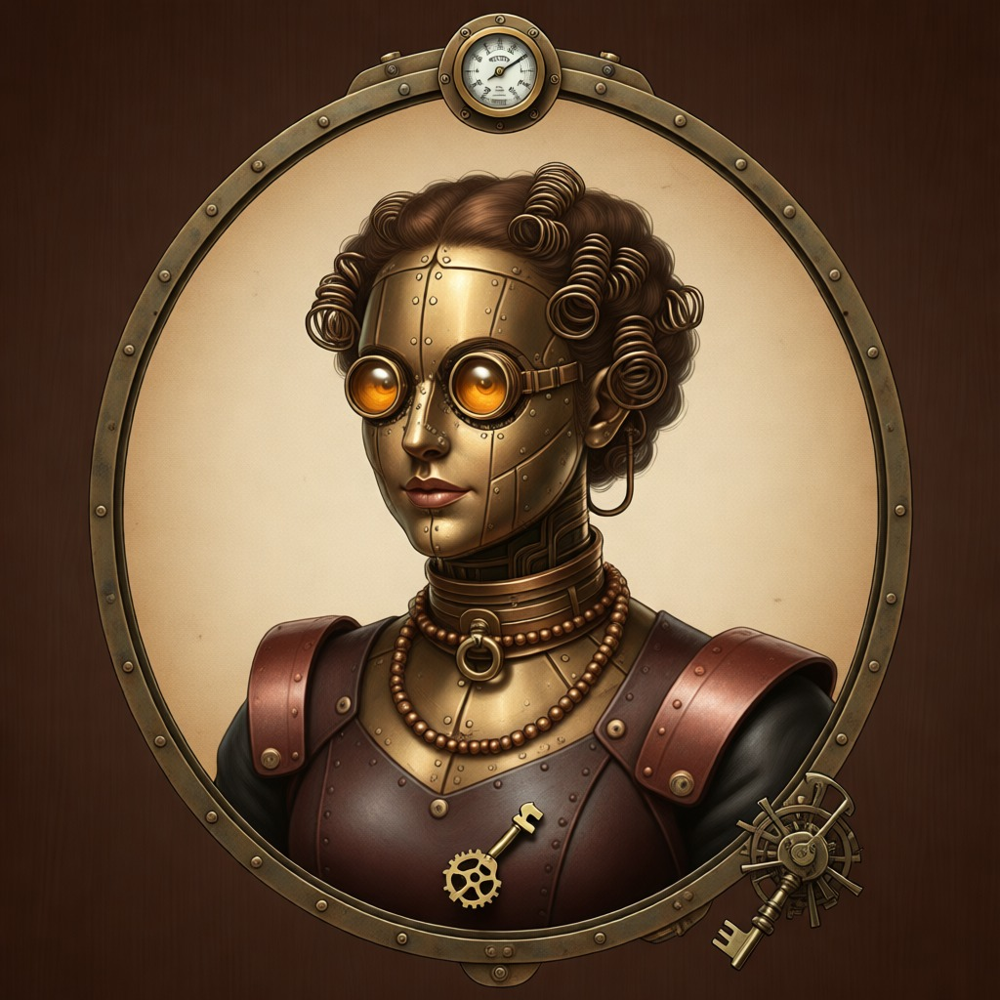
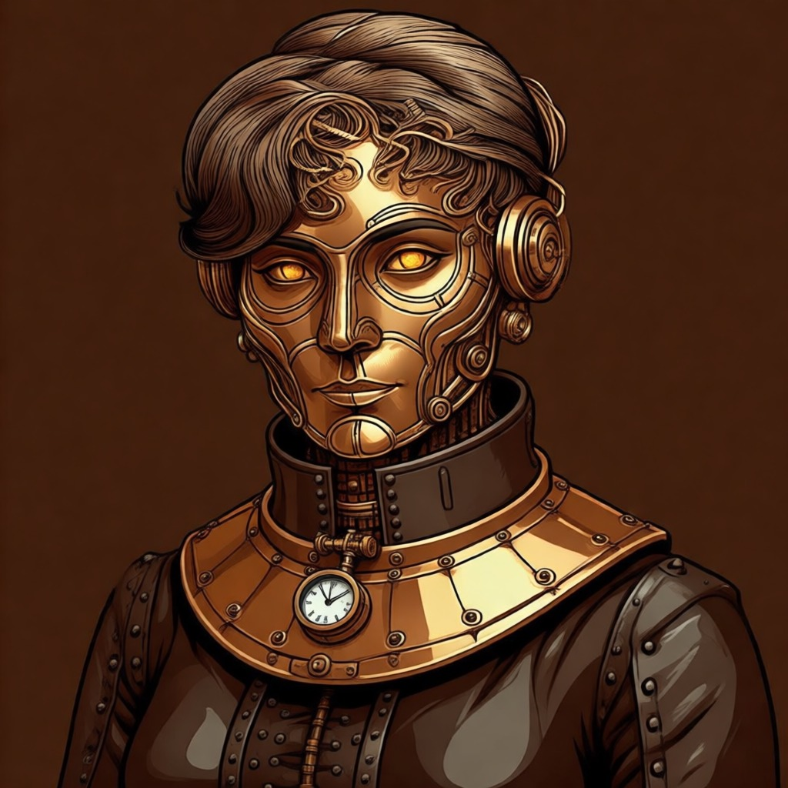
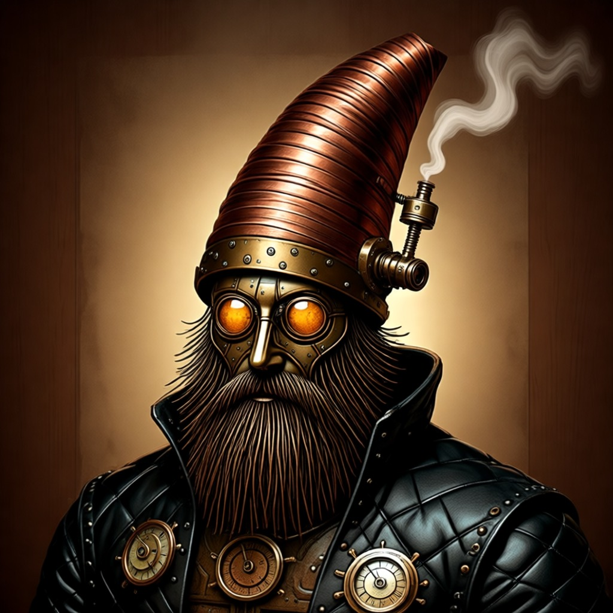
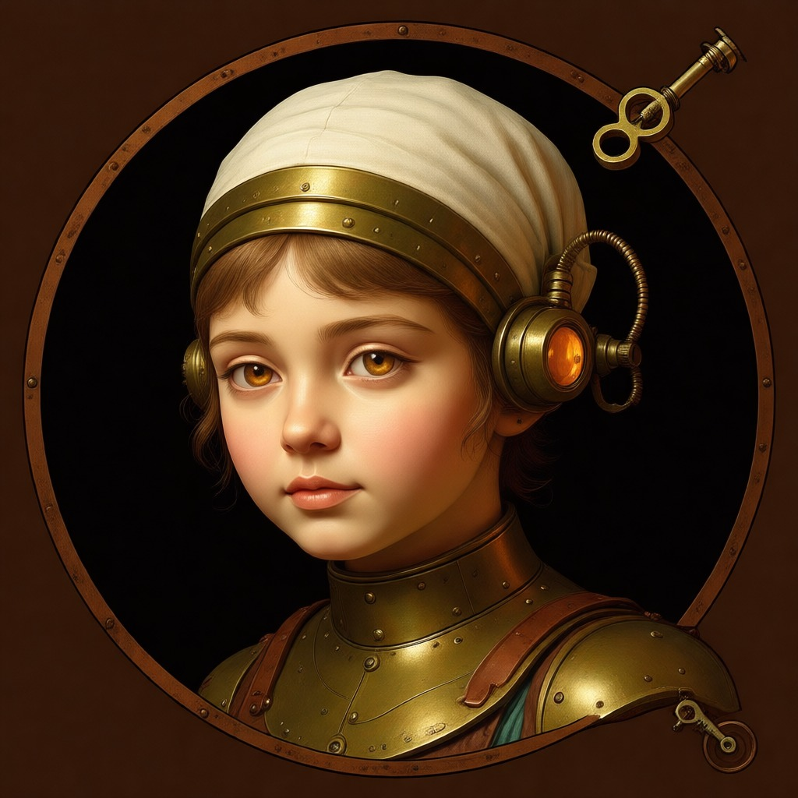

# Examples — before / after

Twelve restyle runs plus nine avatars, each made with the same fidelity contract: lock the composition and identity, re-materialize every visible material, build one readable mechanism into the subject. Each folder holds the input photo, the exact prompt used (`prompt.txt`), and the output.

All input photos are **CC0 or public domain** — free to use, modify, and republish (credits at the bottom). Outputs were generated by [scripts/restyle.py](../scripts/restyle.py) via SiliconFlow (`Qwen/Qwen-Image-Edit-2509`).

## Vehicles & machines

| | Input | Output |
| --- | --- | --- |
| **Car** — engine becomes a vertical boiler with piston drive ([car](car/)) |  |  |
| **Bicycle** — a real brass chain drive: chainring, chain, sprocket ([bicycle](bicycle/)) |  |  |
| **Motorcycle** — dark-red Indian, boiler between the tanks ([motorcycle](motorcycle/)) |  |  |
| **Biplane** — exposed steam radial engine, same hangar ([airplane](airplane/)) |  |  |
| **Airship** — hot-air balloon rebuilt as a riveted brass dirigible ([balloon](balloon/)) |  |  |

## Life & pets

| | Input | Output |
| --- | --- | --- |
| **Cat** — clockwork automaton: chest pocket-watch panel, mainspring + gear train ([cat](cat/)) |  |  |
| **Dog** — boxer as a clockwork automaton, chain collar in brass ([dog](dog/)) |  |  |
| **Latte pour** — the cup's double wall is a boiler; gauge on the rim ([coffee](coffee/)) |  |  |

## Places & faces

| | Input | Output |
| --- | --- | --- |
| **Street musician** — guitar becomes a steam calliope fed by a case-boiler ([street](street/)) |  |  |
| **Clock tower** — the building's one job, mechanized: exposed escapement ([clocktower](clocktower/)) |  |  |
| **Dusk skyline** — neon re-inked to the five inks; gear-crown beacon ([skyline](skyline/)) |  |  |
| **1783 portrait** — Ducreux's yawn, spring-powered: jaw hinge + chest mainspring ([portrait](portrait/)) |  |  |

## Avatar mode — circle-crop-safe

Nine CC0/PD portraits (paintings and museum busts) forged into brass-plate avatars. One shared palette and background; only the mechanism varies per face — neck gear ring, jaw hinge, temple gear, ocular turret, winding key. Square 1:1, designed to survive a circular profile-picture crop. Full-size files in [avatar/](./); the skill's **Avatar mode** rules live in [SKILL.md](../SKILL.md#avatar-mode-face-in--profile-picture-out).

| | | |
| --- | --- | --- |
|  |  |  |
|  |  |  |
|  |  |  |

One-file version for posts: [avatar-grid.jpg](avatar-grid.jpg) (3×3, 1548×1548).

## Input photo credits

| Photo | Author | License | Source |
| --- | --- | --- | --- |
| Car test image | made for this repo | — | synthetic |
| Domestic shorthair cat portrait in grass | Marko Milivojevic | CC0 | [Wikimedia Commons](https://commons.wikimedia.org/wiki/File:Domestic_shorthair_cat_portrait_in_grass.jpg) |
| Self-Portrait, Yawning — Joseph Ducreux, c. 1783 | Joseph Ducreux | Public domain | [Wikimedia Commons / Google Art Project](https://commons.wikimedia.org/wiki/File:Joseph_Ducreux_%28French%29_-_Self-Portrait%2C_Yawning_-_Google_Art_Project.jpg) |
| Street performer, Old Town Market Square, Kraków | Caio | CC0 | [Wikimedia Commons](https://commons.wikimedia.org/wiki/File:Street_performer_Old_Town_Market_Square_Krak%C3%B3w_POLAND_October_2012.jpg) |
| Latte art 3 | Kim Sanso | CC0 | [Wikimedia Commons](https://commons.wikimedia.org/wiki/File:Latte_art_3.jpg) |
| 20180328 Nieuport 28C Udvar-Hazy | Balon Greyjoy | CC0 | [Wikimedia Commons](https://commons.wikimedia.org/wiki/File:20180328_Nieuport_28C_Udvar-Hazy.jpg) |
| Aylesbury market place with clock tower | Poliphilo | CC0 | [Wikimedia Commons](https://commons.wikimedia.org/wiki/File:Aylesbury_market_place_with_clock_tower.jpg) |
| Bicycle 02 | Shams948 | CC0 | [Wikimedia Commons](https://commons.wikimedia.org/wiki/File:Bicycle_02.jpg) |
| A pure and female Boxer dog in Iran 11 | Mostafameraji | CC0 | [Wikimedia Commons](https://commons.wikimedia.org/wiki/File:A_pure_and_female_Boxer_dog_in_Iran_11.jpg) |
| Dark red Indian motorcycle pic1 | Alf van Beem | CC0 | [Wikimedia Commons](https://commons.wikimedia.org/wiki/File:Dark_red_Indian_motorcycle_pic1.JPG) |
| Colorful hot air balloon in flight (Unsplash) | Aaron Burden | CC0 | [Wikimedia Commons](https://commons.wikimedia.org/wiki/File:Colorful_hot_air_balloon_in_flight_%28Unsplash%29.jpg) |
| Downtown Dallas at dusk | Carol M. Highsmith | Public domain | [Wikimedia Commons](https://commons.wikimedia.org/wiki/File:Downtown_Dallas_at_dusk.jpg) |
| Bronze portrait of a man (MET) | The Metropolitan Museum of Art | CC0 | [Wikimedia Commons](https://commons.wikimedia.org/wiki/File:Bronze_portrait_of_a_man_MET_DP337268.jpg) |
| Marble portrait of a man (MET) | The Metropolitan Museum of Art | CC0 | [Wikimedia Commons](https://commons.wikimedia.org/wiki/File:Marble_portrait_of_a_man_MET_DP123871.jpg) |
| Bust of Germanicus (Getty Museum) | J. Paul Getty Museum | CC0 | [Wikimedia Commons](https://commons.wikimedia.org/wiki/File:Bust_of_Germanicus,_front_-_Getty_Museum_%282021.66%29.jpg) |
| Portrait of Rembrandt as St. Paul (MET) | Rembrandt | CC0 | [Wikimedia Commons](https://commons.wikimedia.org/wiki/File:Portrait_of_Rembrandt_as_St._Paul_MET_DP815710.jpg) |
| Marble portrait of a young woman (MET) | The Metropolitan Museum of Art | CC0 | [Wikimedia Commons](https://commons.wikimedia.org/wiki/File:Marble_portrait_of_a_young_woman_MET_DP123890.jpg) |
| Portrait of Elżbieta Mniszech — Vigée Le Brun | Élisabeth Louise Vigée Le Brun | Public domain | [Wikimedia Commons](https://commons.wikimedia.org/wiki/File:Elisabeth_Louise_Vig%C3%A9e-Lebrun_-_Portrait_of_El%C5%BCbieta_Mniszech_%28born_1792%29_-_MNK_XII-A-157_-_National_Museum_Krak%C3%B3w.jpg) |
| Portrait of a Woman — Fantin-Latour (MET) | Henri Fantin-Latour | CC0 | [Wikimedia Commons](https://commons.wikimedia.org/wiki/File:Henri_Fantin-Latour_-_Portrait_of_a_Woman_MET_DP265190.jpg) |
| Portrait of a Man — Sustris (MET) | Lambert Sustris | Public domain | [Wikimedia Commons](https://commons.wikimedia.org/wiki/File:Lambert_Sustris_%28Netherlandish%2C_Amsterdam%2C_born_ca._1510%E2%80%9315%2C_died_after_1560_Venice_%28%5E%29%29_-_Portrait_of_a_Man_-_49.7.14_-_Metropolitan_Museum_of_Art.jpg) |
| Julie Le Brun Looking in a Mirror — Vigée Le Brun (MET) | Élisabeth Louise Vigée Le Brun | Public domain | [Wikimedia Commons](https://commons.wikimedia.org/wiki/File:Elisabeth_Louise_Vig%C3%A9e_Le_Brun_-_Julie_Le_Brun_%281780%E2%80%931819%29_Looking_in_a_Mirror_-_2019.141.23_-_Metropolitan_Museum_of_Art.jpg) |
